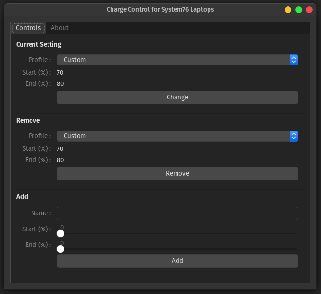
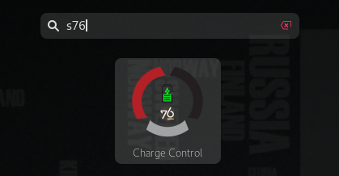

 

# System76 Charge Control (s76cc)
maintained by: @hkdb



### SUMMARY

An unofficial GUI wrapper for [`system76-power` ](https://github.com/pop-os/system76-power) to control charging thresholds for System76 laptops running coreboot. This is specifically only tested with the Lemp9 running Pop! OS 20.04 with Gnome but should be fairly easy to adjust it to work with other System76 laptops or any other laptop that has these settings exposed by their firmware for that matter of fact.

### INSTALLATION

Execute the following in the terminal:
```
$ git clone https://github.com/hkdb/s76cc.git
$ cd s76cc
$ ./install.sh
```

To uninstall from within the repo directory:
```
./uninstall.sh
```

All profiles and configurations are stored in `~/.s76cc` so you may want to manually delete that directory as well after uninstalling the application. To remove it, execute the following in the terminal:

```
rm -rf ~/.s76cc
```

### USAGE

Launch "Activities", search for "s76" or "Charge" and select the app.



If you are already on a custom profile, the app will detect it and automatically add this profile. If you don't like "Custom" as the profile name, you can simply change it with the following steps:

1. In the "Remove" section, select "Custom" and click on the "Remove" button
2. In the "Add" section, type in the profile name that you want in the "Name" field, set the right start and end charge variables and click the "Add" button
3. Restart the app

Now, when the app launches, it will have your new profile name replace the automatically added profile. 

### CHANGE

- 04/28/2021 - v0.1.0 - Initial commit

### DISCLAIMER

This is **NOT** software produced by [System76](https://system76.com) and is in no way affiliated with them.

**In no way do the maintainers make any guarantees. Please use at your own risk!**

### RECOGNITION

This is an application utility sponsored by [3DF Limited](https://3df.io)'s Open Source Initiative.

To Learn more please visit:

[https://osi.3df.io](https://osi.3df.io)


